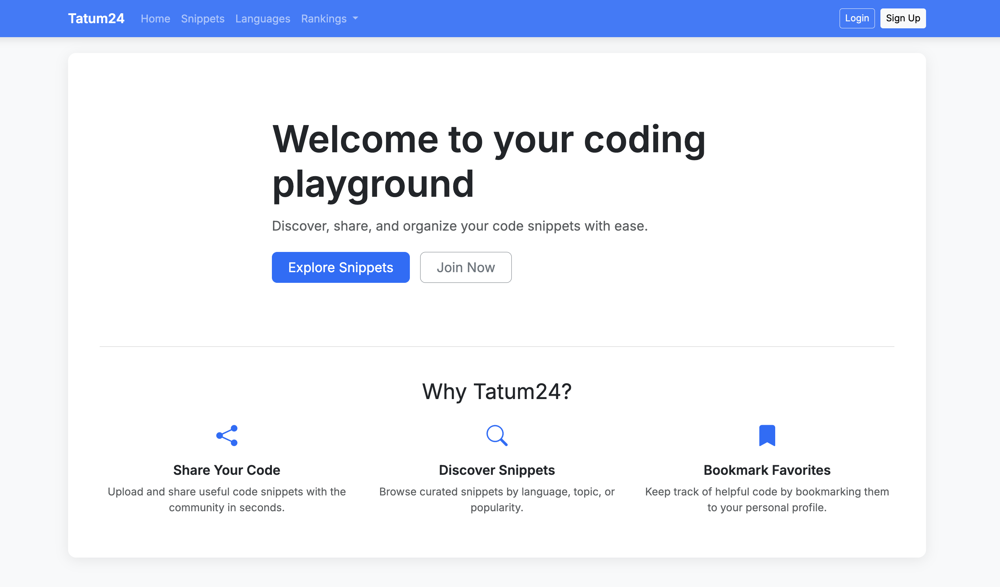

# `Tatum24`

**Tatum24** is a full-stack web application for developers to **share**, **discover**, **bookmark**, and **rate code snippets** across various programming languages. Built with Django, this platform aims to foster a community-driven code-sharing experience with a clean UI and ranked contributions.

## ⚙️ Tech Stack

- **Frontend**: HTML, CSS, Bootstrap 5, Bootstrap Icons
- **Backend**: Django 5
- **Database**: sqlite3
- **Authentication**: Django's built-in authentication system
- **Templating**: Django Templates
- **Code Syntax Highlighting**: Pygments

## 🧩 Features

### 🗂️ Snippet Management
- **CRUD Operations**: Users can create, edit, delete, and view code snippets.
- **Organization**: Snippets are organized by programming language (e.g., Python, JavaScript).
- **Snippet Details**: Each snippet includes a title, author, language, code, and an optional description.

### 📚 Discovery & Search
- **Browse**: View all snippets in reverse chronological order.
- **Filter**: Easily filter snippets by programming language, author, or title using the search bar.

### 🔖 Bookmarking
- **Personalized Bookmarks**: Logged-in users can save snippets to their personal bookmarks for easy access.

### ⭐ Ratings & Rankings
- **User Ratings**: Authenticated users can rate snippets, providing social proof.
- **Rankings**: The platform features rankings for top-rated snippets, authors, and languages.

### 📊 Rankings Dashboard
- **Top Languages**: Displays the most frequently used languages on the platform.
- **Top Snippets**: Highlights the most bookmarked and highest-rated snippets.
- **Top Authors**: Recognizes authors with the most published snippets.

## 🔍 Recommendation System

The platform includes a recommendation engine to suggest snippets based on similarity and user behavior.

### Similar Snippets
The `get_similar_snippets` function recommends snippets similar to the one being viewed by evaluating:
- **Tag Overlap**: Heavily weights shared tags.
- **Language Match**: Provides a significant boost for matching programming languages.
- **Social Proof**: Incorporates snippet ratings.
- **Personalization**: Boosts recommendations from authors the user has previously liked.
> This function excludes the current snippet and any snippets authored by the user.

### User-based Recommendations
The `get_user_recommendations` function generates personalized recommendations for a user by:
- **Tag Aggregation**: Gathers tags from snippets the user has liked.
- **Candidate Filtering**: Finds new snippets that match these tags, excluding those already rated or authored by the user.
- **Scoring**: Ranks candidates based on tag overlap and other factors.
> If the user has no likes, the system defaults to recommending popular snippets.

## 🛠️ Setup Instructions

### Clone the Repository

```bash, aiignore
git clone https://github.com/yourusername/tatum24.git
cd tatum24
```

### Install Dependencies

```bash, aiignore
pipenv install
```

### Activate the Virtual Environment

```bash, aiignore
pipenv shell
```

### Run the Web Application

```bash, aiignore
python manage.py runserver
```
> The site is available at: http://localhost:8000/


# Images




